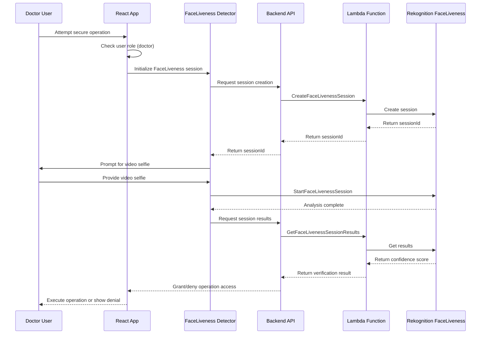

# Design Document: Healthcare FaceLiveness Demo Application

## Overview

This design document outlines the architecture for a healthcare Electronic Health Records (EHR) demo application that showcases Amazon Rekognition FaceLiveness technology. The application implements a two-tier authentication system where all users authenticate through standard AWS Cognito login, and doctor users must complete additional facial verification for sensitive operations.

The application leverages AWS Amplify for full-stack development, providing a React-based frontend with serverless backend integration. The system demonstrates role-based access control with enhanced security for healthcare environments, where unattended doctor sessions cannot be misused for critical patient operations.

## Architecture

### High-Level Architecture


### Authentication Flow


### FaceLiveness Flow for Secure Operations



## Components and Interfaces

### Frontend Components

#### AuthenticationProvider
- **Purpose**: Manages user authentication state and role determination
- **Key Methods**:
  - `signIn(username, password)`: Standard Cognito authentication
  - `signOut()`: Clear authentication state
  - `getCurrentUser()`: Get authenticated user with role information
  - `isAuthenticated()`: Check authentication status
- **State Management**: User object, authentication status, user role (doctor/staff)

#### Dashboard Component
- **Purpose**: Main application interface with role-based feature access
- **Props**: `user` (authenticated user object)
- **Key Features**:
  - Role-based navigation rendering
  - Patient information display (mock data for demo)
  - Secure operation buttons for doctor users
  - Standard healthcare workflow features for all users

#### SecureOperationWrapper
- **Purpose**: Higher-order component that wraps sensitive operations
- **Props**: `requiredRole`, `operation`, `children`
- **Behavior**:
  - Checks user role before rendering
  - Triggers FaceLiveness verification for doctor users
  - Prevents unauthorized access to sensitive features

#### FaceLivenessModal
- **Purpose**: Modal component containing AWS Amplify FaceLivenessDetector
- **Props**: `isOpen`, `onSuccess`, `onError`, `onClose`
- **Integration**: Uses AWS Amplify UI FaceLivenessDetector component
- **Features**:
  - Camera access management
  - User guidance during verification
  - Error handling and retry logic

### Backend API Endpoints

#### Authentication Endpoints
- `POST /auth/signin`: Standard Cognito authentication
- `POST /auth/signout`: Session termination
- `GET /auth/user`: Get current user information with role

#### FaceLiveness Endpoints
- `POST /faceliveness/create-session`: Create FaceLiveness session
- `GET /faceliveness/results/{sessionId}`: Get verification results
- `POST /faceliveness/verify-operation`: Verify operation access

#### Healthcare Data Endpoints (Mock)
- `GET /patients`: Get patient list (role-filtered)
- `GET /patients/{id}`: Get patient details
- `POST /patients/{id}/secure-action`: Perform secure patient operation

### Lambda Functions

#### CreateFaceLivenessSessionFunction
- **Purpose**: Creates Amazon Rekognition FaceLiveness sessions
- **Input**: User ID, operation context
- **Output**: Session ID for frontend use
- **Permissions**: `rekognition:CreateFaceLivenessSession`

#### GetFaceLivenessResultsFunction
- **Purpose**: Retrieves FaceLiveness verification results
- **Input**: Session ID
- **Output**: Confidence score, verification status
- **Logic**: Compares confidence score against threshold (configurable, default 85)
- **Permissions**: `rekognition:GetFaceLivenessSessionResults`

#### SecureOperationAuthorizerFunction
- **Purpose**: Authorizes secure operations based on role and facial verification
- **Input**: User JWT, operation type, verification session ID
- **Output**: Authorization decision
- **Logic**: 
  - Validate user role (must be doctor)
  - Check FaceLiveness verification status
  - Verify session hasn't expired (configurable timeout)

## Data Models

### User Model
```typescript
interface User {
  id: string;
  username: string;
  email: string;
  role: 'doctor' | 'staff';
  firstName: string;
  lastName: string;
  department?: string;
  licenseNumber?: string; // For doctors
  createdAt: string;
  lastLogin: string;
}
```

### FaceLiveness Session Model
```typescript
interface FaceLivenessSession {
  sessionId: string;
  userId: string;
  operationType: string;
  status: 'CREATED' | 'IN_PROGRESS' | 'SUCCEEDED' | 'FAILED';
  confidenceScore?: number;
  createdAt: string;
  completedAt?: string;
  expiresAt: string;
}
```

### Patient Model (Mock Data)
```typescript
interface Patient {
  id: string;
  firstName: string;
  lastName: string;
  dateOfBirth: string;
  medicalRecordNumber: string;
  department: string;
  assignedDoctor?: string;
  lastVisit: string;
  securityLevel: 'standard' | 'sensitive';
}
```

### Secure Operation Model
```typescript
interface SecureOperation {
  id: string;
  name: string;
  description: string;
  requiredRole: 'doctor';
  requiresFaceLiveness: boolean;
  category: 'prescription' | 'diagnosis' | 'procedure' | 'records';
}
```

## Correctness Properties

*A property is a characteristic or behavior that should hold true across all valid executions of a system-essentially, a formal statement about what the system should do. Properties serve as the bridge between human-readable specifications and machine-verifiable correctness guarantees.*

### Authentication Properties

**Property 1: Valid credential authentication**
*For any* user with valid credentials, authentication should succeed and grant dashboard access
**Validates: Requirements 1.1**

**Property 2: Invalid credential rejection**
*For any* user with invalid credentials, authentication should fail and display appropriate error messages
**Validates: Requirements 1.2**

**Property 3: Role-based permission assignment**
*For any* successfully authenticated user, the system should correctly determine their role and assign appropriate dashboard permissions
**Validates: Requirements 1.3**

**Property 4: Session expiration enforcement**
*For any* user session that has expired, the system should require re-authentication before allowing continued dashboard access
**Validates: Requirements 1.5**

### Role-Based Access Control Properties

**Property 5: Staff user standard access**
*For any* authenticated staff user, the dashboard should provide standard healthcare features without facial verification requirements
**Validates: Requirements 2.1**

**Property 6: Doctor user enhanced access**
*For any* authenticated doctor user, the dashboard should provide standard features plus access to secure operations
**Validates: Requirements 2.2**

**Property 7: Staff user secure operation blocking**
*For any* staff user, attempts to access secure operations should be blocked regardless of authentication status
**Validates: Requirements 2.3**

**Property 8: Role-based operation validation**
*For any* user and operation type, the system should validate the user's role against the operation requirements before granting access
**Validates: Requirements 2.4**

### FaceLiveness Verification Properties

**Property 9: Facial verification initiation**
*For any* doctor user attempting a secure operation after standard authentication, the system should initiate facial verification as an additional security layer
**Validates: Requirements 3.1**

**Property 10: Successful verification access grant**
*For any* facial verification that succeeds, the system should grant access to the requested secure operation
**Validates: Requirements 3.2**

**Property 11: Failed verification session preservation**
*For any* facial verification that fails, the system should deny operation access while maintaining the user's authenticated session
**Validates: Requirements 3.3**

**Property 12: Verification session maintenance**
*For any* facial verification in progress, the system should maintain the user's authenticated session throughout the process
**Validates: Requirements 3.5**

### Dashboard Interface Properties

**Property 13: Role-appropriate UI rendering**
*For any* authenticated user, the dashboard should display features and navigation appropriate to their role
**Validates: Requirements 4.1**

**Property 14: Secure operation visual indicators**
*For any* operation requiring additional verification, the dashboard should provide clear visual indicators
**Validates: Requirements 4.3**

**Property 15: Doctor secure operation highlighting**
*For any* doctor user viewing the dashboard, secure operations should be properly highlighted and accessible
**Validates: Requirements 4.4**

### Secure Operations Properties

**Property 16: Secure operation facial verification requirement**
*For any* doctor user initiating a secure operation while authenticated, the system should require successful facial verification as an additional security layer
**Validates: Requirements 5.1**

**Property 17: Operation classification consistency**
*For any* operation defined as a secure operation, the system should consistently apply facial verification requirements based on healthcare sensitivity levels
**Validates: Requirements 5.2**

**Property 18: Secure operation audit logging**
*For any* completed secure operation, the system should log the action with user identity, authentication status, and facial verification status
**Validates: Requirements 5.3**

**Property 19: Facial verification enforcement**
*For any* secure operation attempt, the system should prevent execution without completed facial verification, regardless of standard authentication status
**Validates: Requirements 5.4**

**Property 20: Verification expiration handling**
*For any* expired or failed facial verification, the system should require re-verification for subsequent secure operations while maintaining the standard authenticated session
**Validates: Requirements 5.5**

### User Experience Properties

**Property 21: Authentication feedback**
*For any* authentication attempt in progress, the system should display appropriate loading indicators and status messages
**Validates: Requirements 7.1**

**Property 22: Facial verification guidance**
*For any* required facial verification, the system should provide instructions and camera access guidance
**Validates: Requirements 7.2**

**Property 23: Error message security**
*For any* operation failure, the system should display helpful error messages without exposing sensitive security details
**Validates: Requirements 7.3**

**Property 24: Success confirmation**
*For any* successfully completed operation, the system should provide visual confirmation
**Validates: Requirements 7.4**

### Security Properties

**Property 25: Data transmission encryption**
*For any* data transmission between client and server, the system should use encryption (HTTPS)
**Validates: Requirements 8.1**

**Property 26: Session timeout management**
*For any* user session, the system should implement appropriate timeout periods for healthcare environments
**Validates: Requirements 8.2**

**Property 27: Security event logging**
*For any* security-relevant event (authentication attempts, facial verification results), the system should create appropriate logs
**Validates: Requirements 8.3**

**Property 28: Patient data access control**
*For any* attempt to access patient data, the system should enforce proper access controls to prevent unauthorized access
**Validates: Requirements 8.4**

**Property 29: Audit trail maintenance**
*For any* sensitive operation, the system should maintain audit trails for compliance purposes
**Validates: Requirements 8.5**

## Error Handling

### Authentication Errors
- **Invalid Credentials**: Display user-friendly error message without revealing whether username or password was incorrect
- **Network Errors**: Provide retry mechanism with exponential backoff
- **Session Expiration**: Graceful redirect to login with context preservation
- **Account Lockout**: Clear messaging about lockout status and recovery options

### FaceLiveness Errors
- **Camera Access Denied**: Provide clear instructions for enabling camera permissions
- **Poor Lighting Conditions**: Guide user to improve lighting setup
- **Face Not Detected**: Provide positioning guidance with visual feedback
- **Verification Timeout**: Allow retry with fresh session creation
- **Service Unavailable**: Fallback to alternative verification methods or admin override

### System Errors
- **API Failures**: Graceful degradation with offline-capable features where possible
- **Database Errors**: Appropriate error messages without exposing technical details
- **Permission Errors**: Clear explanation of required permissions and escalation paths
- **Validation Errors**: Field-specific error messages with correction guidance

### Healthcare-Specific Error Handling
- **Patient Data Access Errors**: HIPAA-compliant error messages
- **Audit Log Failures**: Critical error handling with administrative alerts
- **Compliance Violations**: Immediate lockdown with audit trail preservation

## Testing Strategy

### Dual Testing Approach

The application will implement both unit testing and property-based testing to ensure comprehensive coverage:

- **Unit Tests**: Validate specific examples, edge cases, and error conditions
- **Property Tests**: Verify universal properties across all inputs using randomized test data
- Both approaches are complementary and necessary for healthcare application reliability

### Property-Based Testing Configuration

- **Testing Library**: Use `fast-check` for JavaScript/TypeScript property-based testing
- **Test Iterations**: Minimum 100 iterations per property test to ensure statistical confidence
- **Test Tagging**: Each property test must reference its design document property using the format:
  - **Feature: healthcare-faceliveness-demo, Property {number}: {property_text}**

### Unit Testing Focus Areas

- **Authentication Edge Cases**: Empty credentials, malformed tokens, expired sessions
- **Role Assignment Logic**: Boundary conditions for role determination
- **FaceLiveness Integration**: Mock service responses, timeout handling
- **UI Component Behavior**: Form validation, loading states, error displays
- **Security Boundary Testing**: Authorization bypass attempts, privilege escalation

### Property Testing Focus Areas

- **Authentication Flows**: All valid credential combinations should authenticate successfully
- **Role-Based Access**: All users should receive appropriate permissions based on their role
- **FaceLiveness Verification**: All successful verifications should grant operation access
- **Session Management**: All expired sessions should require re-authentication
- **Audit Logging**: All security events should be properly logged

### Integration Testing

- **End-to-End Workflows**: Complete user journeys from login to secure operation completion
- **AWS Service Integration**: Cognito authentication, Rekognition FaceLiveness, S3 storage
- **Cross-Browser Compatibility**: Testing across healthcare environment browsers
- **Mobile Responsiveness**: Tablet and mobile device testing for healthcare settings

### Security Testing

- **Penetration Testing**: Simulated attacks on authentication and authorization systems
- **Session Security**: Session hijacking and fixation testing
- **Data Protection**: Encryption verification and data leakage prevention
- **Compliance Validation**: HIPAA compliance verification for healthcare data handling

### Performance Testing

- **Load Testing**: Concurrent user authentication and facial verification
- **Latency Testing**: FaceLiveness response times under various network conditions
- **Scalability Testing**: System behavior under increasing user loads
- **Resource Usage**: Memory and CPU usage optimization for healthcare devices